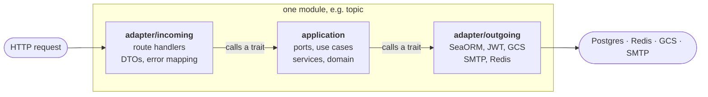
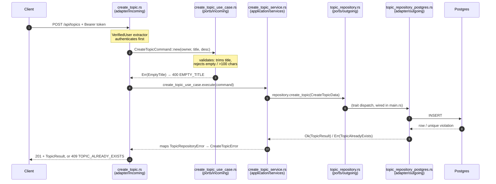
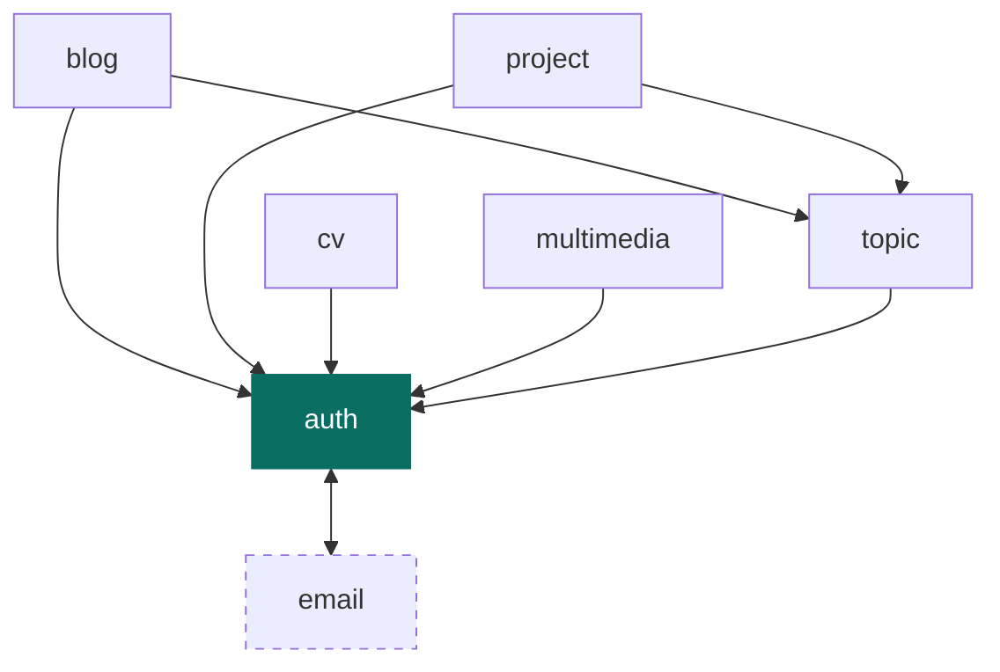

# Architecture

How `backend_actix` is put together, and the rules that keep it that way.

This is the document to read before your first change. It assumes competent
Rust and no knowledge of this codebase. If you only want the practical answer
to "where does my new code go", skip to [Where things go](#where-things-go).

**Contents**

- [The shape in one picture](#the-shape-in-one-picture)
- [The dependency rule](#the-dependency-rule)
- [The four layers](#the-four-layers)
- [A request, traced end to end](#a-request-traced-end-to-end)
- [Vocabulary](#vocabulary)
- [The seven modules](#the-seven-modules)
- [How the modules depend on each other](#how-the-modules-depend-on-each-other)
- [The composition root](#the-composition-root)
- [Shared and cross-cutting code](#shared-and-cross-cutting-code)
- [Two known structural issues](#two-known-structural-issues)
- [Convention drift, and which convention to follow](#convention-drift-and-which-convention-to-follow)
- [Where things go](#where-things-go)

---

## The shape in one picture

The crate is one binary, split into seven **modules** under `src/modules/`.
Each module is a vertical slice of the product — it owns its routes, its
business logic, its database tables and its errors — and each is internally
split into the same three layers.



The important part is what the arrows mean: **they are dependencies, and they
only point inward and then outward through traits.** The application layer in
the middle never names a concrete adapter. It defines traits — *ports* — and
the adapters implement them. Which concrete implementation gets used is decided
once, in `main.rs`, at startup.

That is the whole idea. Everything below is detail.

---

## The dependency rule

> **The `application` layer may not depend on the `adapter` layer.**

Adapters depend inward on the application layer. The application layer depends
only on itself, its own ports, and its domain types. This is what makes the use
cases testable without a database, and what lets you swap Postgres for anything
else by writing one new file.

The rule currently holds. You can check it yourself — this prints every
`adapter` import that appears in the application layer *before* the file's
`#[cfg(test)]` marker, and should print nothing:

```bash
python3 - <<'EOF'
import pathlib
for f in pathlib.Path('src/modules').rglob('application/**/*.rs'):
    prod = f.read_text().split('#[cfg(test)]')[0]
    for n, line in enumerate(prod.splitlines(), 1):
        if 'adapter' in line and line.lstrip().startswith('use '):
            print(f"{f}:{n}: {line.strip()}")
EOF
```

There are currently four `adapter` imports inside `application` directories —
all in `auth/application/use_cases/`, all below the `#[cfg(test)]` marker,
where a test reaches for the real `JwtTokenService` rather than mocking it.
None are in production code.

If you are reviewing a change, this is the single most valuable thing to
check: nothing in the build enforces it yet.

---

## The four layers

### `adapter/incoming` — the outside world talking to us

Route handlers, request and response DTOs, and the mapping from application
errors to HTTP status codes and error strings. This layer knows about Actix,
JSON, headers and status codes. Nothing else does.

A handler's job is narrow: extract, translate into an application type, call a
trait, translate the result back. Business rules do not live here.

### `application/ports` — the contracts

Two directions, and the distinction matters:

- **`ports/incoming`** — what this module *offers*. Traits the route handlers
  call, plus the command and error types they speak in. This is the module's
  public API.
- **`ports/outgoing`** — what this module *needs*. Traits like
  `TopicRepository` or `PasswordHasher` that some adapter must implement, plus
  the data and error types they exchange.

Both are just traits. Neither knows who implements it.

### `application` — the logic

The implementations of the incoming ports. They orchestrate: validate, call
outgoing ports, translate outgoing errors into the errors the endpoint speaks.
They hold no SQL, no HTTP, no `sea_orm` imports.

### `application/domain` (or `domain`) — the types the business is written in

Value objects and entities: `UserId`, `Slug`, and the invariants that come with
them. The innermost layer; it depends on nothing above it.

### `adapter/outgoing` — us talking to the outside world

The concrete implementations: SeaORM repositories, the JWT service, the Argon2
hasher, the GCS client, the SMTP sender, the Redis token store. Each implements
an outgoing port. Each module keeps its own SeaORM entity definitions under
`adapter/outgoing/sea_orm_entity/`, so a table's shape is a detail of the
module that owns it.

---

## A request, traced end to end

`POST /api/topics` is the smallest complete example in the codebase. Six files,
one per layer boundary.



Reading it in files:

**1. `topic/adapter/incoming/web/routes/create_topic.rs`** — declares the
route, the request DTO and the OpenAPI annotation. Authenticates via the
`VerifiedUser` extractor. Builds the command, calls the use case, and owns the
two error-mapping functions that turn application errors into status codes and
error codes.

**2. `topic/application/ports/incoming/use_cases/create_topic_use_case.rs`** —
declares `CreateTopicCommand`, whose fields are private and whose constructor
returns `Result`, so a handler cannot build an invalid command; the error enums
`CreateTopicCommandError` and `CreateTopicError`; and the trait
`CreateTopicUseCase`.

**3. `topic/application/services/create_topic_service.rs`** —
`CreateTopicService<R: TopicRepository>` implements that trait. It converts the
command into `CreateTopicData` and maps `TopicRepositoryError` onto
`CreateTopicError`. Note it is generic over the repository, not holding a
`dyn` — the trait object appears later, in `AppState`.

**4. `topic/application/ports/outgoing/topic_repository.rs`** — the
`TopicRepository` trait plus `CreateTopicData`, `TopicResult` and
`TopicRepositoryError`.

**5. `topic/adapter/outgoing/topic_repository_postgres.rs`** — the SeaORM
implementation.

**6. `main.rs`** — the only place the two halves meet:

```rust
let topic_repo   = TopicRepositoryPostgres::new(Arc::clone(&db_arc));
let create_topic_uc = CreateTopicService::new(topic_repo.clone());
// …stored in AppState as Arc<dyn CreateTopicUseCase + Send + Sync>
```

Notice where each concern lives. Validation is in the command constructor, not
the handler. The HTTP status code is in the handler, not the service. The SQL
is in the adapter, and the service that maps its errors never imports it.

---

## Vocabulary

Four words appear in directory names and they are not synonyms.

| Term | What it is | Where |
| --- | --- | --- |
| **Use case** | The *contract* for one business operation — a trait, plus its command and error types. In the older modules the trait sits beside its implementation instead. | `ports/incoming/use_cases/` |
| **Service** | The *implementation* of a use-case trait. Depends only on outgoing ports. | `application/service(s)/` |
| **Orchestrator** | Composes several use cases, usually with a cross-module side effect. Exists once: `UserRegistrationOrchestrator` calls `CreateUserUseCase`, then sends a verification email through `email`'s notifier port. Reach for one only when a single operation genuinely spans two use cases. | `application/orchestrator/` |
| **Helper** | A small shared collaborator that is not itself a use case. Exists once: `UserIdentityResolver` turns a username into a `UserId` via the `UserQuery` port, and several modules' routes need that. | `application/helpers/` |

If you are adding a normal endpoint, you want a use-case trait and a service.
The other two are exceptions and should stay rare.

---

## The seven modules

| Module | Owns | Routes | Depends on |
| --- | --- | --- | --- |
| **auth** | Users, JWTs, password hashing, sessions, token blacklist. Owns `UserId`, which everything else uses. | 9 | `email` (ports only) |
| **blog** | Blog posts, publication lifecycle, post↔topic links. | 13 | `auth`, `topic` |
| **project** | Projects, project↔topic links, public project views. | 12 | `auth`, `topic` |
| **cv** | CVs/résumés, including public read views. | 9 | `auth` |
| **multimedia** | Media uploads: signed GCS URLs, variants, upload policy. | 5 | `auth` |
| **topic** | Topics, scoped per user. Shared vocabulary for blog and project. | 3 | `auth` |
| **email** | Verification and password-reset mail. **Support module — no incoming adapter, no routes.** Other modules call it through ports. | 0 | `auth` |

`email` is the odd one and deliberately so: it has no `adapter/incoming`
because nothing outside the process calls it. It exists to own an outgoing
concern that two auth flows need.

---

## How the modules depend on each other



Two properties worth naming.

**`auth` is a de-facto shared kernel.** All six other modules import from it —
36 production imports in `project`, 12 in `blog`, 10 in `cv`. Almost all of
that is `UserId` and the `VerifiedUser` extractor, which is reasonable: every
resource in the product is owned by a user, and every authenticated route needs
the same extractor.

**`auth` and `email` import each other.** Rust permits cycles inside a crate,
so this compiles, but it is a real cycle. See below.

---

## The composition root

`main.rs` is the only file that knows both halves of every port. It constructs
concrete adapters, wraps each service in an `Arc<dyn …>`, and stores them in
`AppState`, which every handler receives through `web::Data`.

This is why `main.rs` is excluded from coverage: it is wiring, and covering it
means booting the process against a real database and Redis.

`AppState` has 27 fields, and two shapes coexist in it. The older modules
contribute 22 flat `Arc<dyn …>` fields:

```rust
pub struct AppState {
    pub create_cv_use_case: Arc<dyn ICreateCVUseCase + Send + Sync>,
    pub login_user_use_case: Arc<dyn ILoginUserUseCase + Send + Sync>,
    // …
```

The newer ones contribute one grouped struct each — `BlogUseCases`,
`ProjectUseCases`, `MultimediaUseCases` — plus `UserIdentityResolver` and
`UploadPolicy`, which are shared collaborators rather than use cases. Prefer
the grouped form; see the drift section.

Note the two-step generic-then-`dyn` pattern: services are generic over their
ports (`CreateTopicService<R: TopicRepository>`), which keeps them
monomorphised and easy to unit-test with a hand-written stub, and the trait
object appears only at the `AppState` boundary where a uniform type is needed.

---

## Shared and cross-cutting code

`src/shared/` holds what is not any module's business:

- **`shared/api`** — the `ApiResponse` envelope every endpoint returns
  (`{ success, data, error: { code, message } }`), the CORS builder, and the
  JSON extractor config.
- **`shared/rate_limit`** — the Actix middleware, the `RateLimitStore` port,
  its Redis implementation, and the per-endpoint policy table.

`src/api/` holds the OpenAPI document: `ApiDoc` lists every path and schema,
and a test walks the serialised document asserting every `$ref` resolves.
**If you add a route, you must register it in `src/api/openapi.rs`** or that
test fails.

`src/health.rs` holds the two probes: `/health` (process is up) and `/ready`
(Postgres and Redis are both reachable).

---

## Two known structural issues

Both are described here rather than filed away, because you will notice them
within an hour of reading the code and deserve to know they are known.

### 1. `auth` and `email` form a cycle

`auth` depends on `email`'s ports — `UserEmailNotifier`, `PasswordResetNotifier`
— which is the right direction: auth needs to send mail and depends on an
abstraction rather than SMTP.

The cycle comes from the other side. `email`'s port is *typed in terms of
auth's DTO*:

```rust
// email/application/ports/outgoing/user_email_notifier.rs
use crate::auth::application::use_cases::create_user::CreateUserOutput;
```

and `email_service.rs` additionally imports auth's `TokenProvider`. So `email`
cannot be understood, moved or tested without `auth`, even though it is
conceptually the more generic of the two.

**Recommendation.** Give the notifier port its own small input type owned by
`email` — a struct of the three or four fields the templates actually need —
and have `auth` construct it. That breaks the cycle at its single real cause
and costs one type plus one `From` impl. Leave the `TokenProvider` dependency
alone for now: token minting genuinely is auth's job, and the honest fix there
is a separate link-signing port, which is a larger change than the problem
justifies today.

### 2. `auth`'s domain is an unmanaged shared kernel

Six modules import `auth::application::domain::entities::UserId`, and five
also import `auth::adapter::incoming::web::extractors::auth::VerifiedUser`.
Nothing marks these as a stable published surface, so a change to `UserId` is
a change to every module, and nothing says so.

**Recommendation.** Do not try to eliminate this — a shared identity type in a
product where everything is user-owned is correct, and splitting it would cost
more than it returns. Instead make it deliberate: document `UserId` and
`VerifiedUser` as auth's published surface, and treat changes to them as
breaking. When Phase 4 adds doc comments, these two types are the highest-value
place to start.

The `VerifiedUser` case is worth one extra note: it is an
`adapter/incoming` type used by other modules' `adapter/incoming` code. That is
adapter-to-adapter across modules, which does not violate the dependency rule —
both sides are the same layer, and the alternative is duplicating the extractor
seven times.

---

## Convention drift, and which convention to follow

The codebase holds two generations of the same pattern. `auth` and `cv` are the
originals; `topic`, `project`, `multimedia` and `blog` came later and converged
on something different.

| | Older (`auth`, `cv`) | Newer (`topic`, `project`, `multimedia`, `blog`) |
| --- | --- | --- |
| Use-case trait | Beside its impl in `application/use_cases/` | In `application/ports/incoming/use_cases/` |
| Trait naming | `ICreateCVUseCase` — 13 traits carry the `I` prefix, all in these two modules | `CreateTopicUseCase`, implemented by `CreateTopicService` |
| `AppState` | ~20 flat fields | One grouped struct per module |

**Follow the newer convention.** Three reasons, in order of weight:

1. **An incoming port belongs with the other ports.** It is the contract the
   adapter depends on. Putting it in `ports/incoming/` means `ls` shows you
   everything a module offers; in `auth` and `cv` you have to grep for
   `trait I*` across implementation files to learn the same thing.
2. **The `I` prefix is a C#/TypeScript convention, not a Rust one.** Rust gives
   the trait the plain name and qualifies the implementation. The newer modules
   already do this — `CreateTopicUseCase` / `CreateTopicService` — which
   resolves the naming collision the prefix was invented to avoid.
3. **Grouped `AppState` fields scale.** The struct is already at 27 fields, 22
   of them flat.

Two things are **not** part of that generational split, and one of them cuts
the other way:

- **`domain/` placement is inconsistent across both generations.** It sits at
  the module root in `blog` and `cv`, and under `application/` in `auth`,
  `topic` and `multimedia`. **The module root is the more correct placement**:
  domain is the innermost layer and `application` depends on *it*, so nesting
  it inside `application` inverts the relationship the directory tree is
  supposed to express. Here the older `cv` gets it right and the newer `topic`
  does not — so prefer module-root `domain/` regardless of which generation
  you are copying from.
- **`service/` versus `services/`** is pure inconsistency with no argument on
  either side. `blog` and `project` use the singular; `auth`, `cv`, `topic` and
  `email` use the plural. Not worth a migration; match whatever the module you
  are editing already uses.

None of this is urgent. It is drift, not breakage, and a module-by-module
migration would touch a lot of files to change no behaviour. The point of
recording it is that **new code should not add to it.**

---

## Where things go

| You are adding… | It goes in… |
| --- | --- |
| A new endpoint on an existing module | `<module>/adapter/incoming/web/routes/`, plus a route registration in `main.rs::init_routes` **and** an entry in `src/api/openapi.rs` |
| The business logic behind it | A trait in `<module>/application/ports/incoming/use_cases/`, implemented by a service in `<module>/application/service(s)/` |
| A new thing the logic needs from outside | A trait in `<module>/application/ports/outgoing/`, implemented in `<module>/adapter/outgoing/` |
| A database table | A migration in `migration/src/`, and a SeaORM entity in `<module>/adapter/outgoing/sea_orm_entity/` |
| A validation rule | The command's constructor in `ports/incoming/`, or a domain type — not the handler |
| A new error the client can see | A variant on the use case's error enum, mapped to a status and error code in the handler |
| Something two modules need | An outgoing port in the module that owns the concern; import it from the other. If it is HTTP-shaped and used by many, `src/shared/api/` |
| A whole new feature area | A new module under `src/modules/`, following the newer convention above |

Two rules that are easy to miss and will fail the build or the review:

1. **Register new routes in `src/api/openapi.rs`.** The `$ref` test fails
   otherwise.
2. **Never import `adapter` from inside `application`.** Nothing enforces it
   yet; it is enforced by review.
